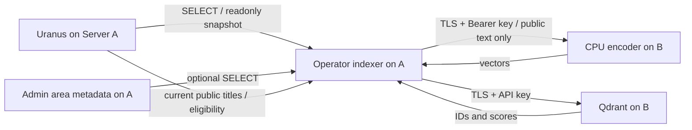

# Event retrieval pilot

This is an operator-only retrieval benchmark, not a public search API or LLM chat.
Uranus/PostgreSQL remains the factual source. No Uranus writes, DDL, triggers, outbox,
source indexes or source-side synchronization state are introduced.

## Verified baseline (2026-09-27)

Development started from `dev` at `2e074e8` (includes merged #134 and #135).
The live deployment on Server A was still release `8a11d2deedb5f6f3751200fb21877efbc94960bb`,
admin migration `0015`, with no `admin.research_area`. An isolated pilot checkout is
used; the running backend/frontend/workers are not upgraded by this work.

| Area           | Observed pattern / pilot choice                                       |
| -------------- | --------------------------------------------------------------------- |
| SQL            | Async SQLAlchemy Core, explicit projections, bound values, bulk joins |
| Transactions   | Source READ ONLY / REPEATABLE READ, UTC, bounded timeouts             |
| Locations      | Existing EFFECTIVE_VENUE_SQL / EFFECTIVE_SPACE_SQL                    |
| Public status  | Existing Research parent/effective-date status rules                  |
| Areas          | Imported admin PostGIS polygons, ST_Covers; no live Nominatim         |
| Errors         | Fixed safe categories, no provider/driver exception text              |
| CLI            | Explicit argparse one-shot operator entry point                       |
| Config         | Validated server settings; no browser credentials                     |
| Tests          | Synthetic fixtures, mock HTTP, disposable PostGIS and Qdrant          |
| Infrastructure | Existing B Docker/nginx; separate compose project and TLS ports       |

Live source audit: 619 events, 1,138 event dates, 262 venues, 137 spaces,
238 organizations. 576 events satisfy the public Research gate. Counts are a
snapshot, not a source contract. The source role had no effective DML privileges;
the CLI verifies the effective role boundary again before extraction.

## Data flow

Server A: `89.58.56.254`. Server B: `89.58.44.151`.
Server B never receives database credentials or a database connection. The service
receives only allowlisted, normalized public sections and opaque event IDs. The
index stores vectors and bounded provenance/context payloads, not full descriptions.

Both source and optional admin snapshots close before external HTTP. The admin
connection also uses READ ONLY. Missing area storage is reported as
`area_assignment_available=false`, not as a fabricated municipality. Other database
errors fail the run; they are never treated as a clean empty source.

## Security and resources

Qdrant binds through Docker only to `127.0.0.1:6333`; encoder to
`127.0.0.1:6335`. Port 6334 is not published. Separate nginx listeners 7443/7444
reuse the existing valid `nominatim.oklabflensburg.de` certificate. This does not
change the Nominatim service or make it an embedding provider.

Both listeners allow only Server A and require service authentication. A dedicated
nftables input chain restricts exactly those two ports for IPv4/IPv6; existing
Docker/firewall tables remain intact. TLS certificate verification stays enabled.
Do not open these ports anonymously or expose the raw container ports.

Single-node Qdrant: 2 GiB RAM/swap ceiling, 2 CPUs, one search/indexing worker where
configurable. Encoder: 5 GiB RAM/swap ceiling, 2 CPUs, batch 2, one admitted request
and one loaded model at a time. The larger encoder budget is for Jina's CPU float32
weights and activations. Both containers drop capabilities and use UID 10001,
no-new-privileges and bounded Docker logs. Encoder filesystem/model cache is read-only.

Normal runtime is offline for model loading, uses pinned safetensors and
`trust_remote_code=False`. Explicit prefetch is separate and downloads only pinned
model data, never executable repository code. Request bodies, results and vectors
are bounded. No arbitrary model ID, URL fetch, shell command or code input exists.

No LLM is installed: first measure event retrieval, deduplication and provenance.
Future planners/chat must revalidate public eligibility and fetch facts from Postgres;
a vector hit alone is never authorization or a factual answer.
