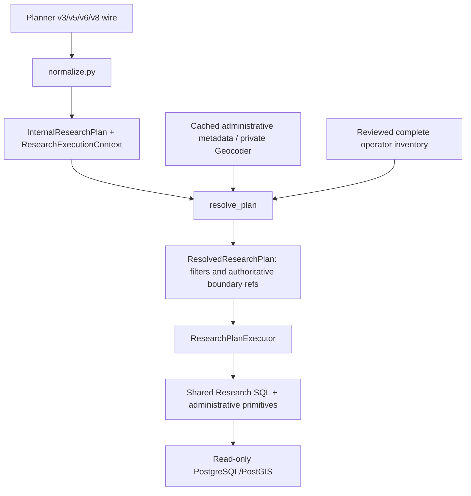

# Administrative execution on the shared Research architecture

## Responsibilities and request path



PR #173 was rebased on `c5772d3d4576dbeefb5d398c86f163f673604ae9`,
which includes merged #172. Its original competing `internal_plan.py` and
`normalizer.py` were removed. There is only `plan.py::InternalResearchPlan`,
`normalize.py` and `repositories/research_resolution.py::resolve_plan`.
`services/research_administrative.py` is a thin versioned transport edge: one
Planner call, normalization and the same `ResearchPlanExecutor.execute` used by
the legacy route. It does not resolve names, access a database or select SQL.

The common executor validates capabilities, resolves, creates the internal
`ResolvedResearchPlan`, and dispatches a generic primitive. Resolved selections
contain no raw area/category queries or wire fields. They keep shared
`ExecutionFilters` and typed boundary/inventory identities. Existing result models
are reused; administrative coverage metadata additionally feeds the backend v8
response projection. Internal models remain absent from OpenAPI.

`research/wire/` is only a pinned wire mirror. No version-specific executor,
resolver entry point or eligibility population exists. The v8 endpoint does not
change the default browser Research route or silently fall back to v6.

The new authenticated backend endpoint accepts only a question; browser-submitted
plans are rejected. Existing journalist/system-admin authorization, body limits,
Origin/CSRF checks and safe error envelopes remain. No frontend proxy wildcard or
browser access to private service keys was introduced.

## Core model, identities and hierarchy

The existing `UnresolvedAdministrativeAreaRef` carries a name, expected level and
optional country constraint. `ResolvedAdministrativeAreaRef` carries authoritative
name, level, country, optional official code/scheme, resolved identity and
`BoundaryReference`. These are the #172 domain types, extended rather than copied.
Levels remain country, state, district, municipality and region.

Cached identities remain UUIDs. Geocoder identities use
`osm:<N|W|R>:<id>:<level>`, constructed only from a verified lookup. This is an
Admin reference, **not an official code**. The role distinguishes dual
municipality/district objects. Country casing is normalized to uppercase internally;
provided official codes and namespaces are retained unchanged, absent codes remain
unknown. BoundaryReference retains the identity and validated polygon JSON for
this transient selection. Geometry never appears in normal records or URLs.

Parent/child intent preserves the subject and grouping level independently of
spatial constraints. For municipalities in Nordfriesland, the subject/group is
municipality and the parent predicate is inside a resolved district. The same
model handles districts inside a state. A catalog may be explicitly scoped by its
resolved `parent_area_id`; hierarchy filtering additionally checks full boundary
coverage in PostGIS. A parent name is never inferred from a code prefix.

## Resolution and ambiguity

The private client validates every administrative field and polygon shape, retains
its bounded loopback-only transport, and never reflects provider error text.
Ordinary legacy Place projections strip the private metadata after validation so
existing browser contracts remain unchanged. Search replies remain bounded to five
candidates/256 KiB; explicit boundary lookup to 8 MiB. No request bodies are logged.

Resolver selection first checks observed roles and optional country context, then
canonical exact names among eligible candidates. Multiple distinct eligible
identities require clarification; candidate order is irrelevant. The lookup must
confirm the requested OSM type/ID, country and role. Missing geometry, unknown
levels and district/state mismatches fail explicitly. A bounding box or centroid
never stands in for an administrative boundary. New administrative metadata comes from the Geocoder. The isolated transitional
metadata adapter from #172 remains for existing persisted cache rows; neither
domain types nor the executor interpret numeric OSM levels. The Planner's expected role cannot overwrite it.

## Membership and event location

The source projection is `repositories/research.py::research_sql(occurrences=True)`.
It retains the existing public event/date status gates, category interpretation,
organization joins and event-date venue overrides. The effective venue is
`COALESCE(event_date.venue_uuid, event.venue_uuid)`; a date venue override stops
inheritance of the event's space, as defined in `repositories/location.py`.
The authoritative point is that effective venue's `venue.point`. No space point,
browser location, suggested geocode or direct event geometry is invented.
An undated event retains the existing projection's unknown location semantics.

For each eligible occurrence point:

- inside = `ST_CoveredBy(point, boundary)`;
- outside = `NOT ST_CoveredBy(point, boundary)`, only for a known valid point;
- every ANDed condition applies to the **same occurrence** before distinct event
  counting. One occurrence outside SH and a different one inside Germany do not
  jointly satisfy outside SH AND inside Germany.

A boundary point is inside and not outside. All input polygons undergo PostGIS
validity/nonempty checks before membership evaluation. Unknown locations are
excluded from spatial matches and reported separately as
`unknown_location_count`: distinct eligible events with no known eligible occurrence
point, after shared hard filters but before spatial matching/inventory grouping.
NULL, EMPTY, nonfinite and out-of-range points remain unknown, never outside.
An event with both an inside and an outside occurrence can appear in each separate
query; inside/outside are complements per point, not per multi-location event.

Administrative grouping counts distinct event IDs in each boundary. Shared boundary
points can count in both adjacent groups because coverage includes their edges;
totals across groups are therefore not necessarily additive. Parent inside means
full child-boundary coverage; outside is its complement. The point constraints
also apply to counted occurrences. Grouping products exceeding two million occurrence/area pairs fail with
`research_execution_too_broad`; DB statement timeouts also remain active.
Source access remains read-only; there are no
Uranus DML, source migrations, schema changes or new source-location assumptions.

## Complete grouping inventories

Search is not an exhaustive inventory. Ranking and especially `event_count = 0`
require an explicit complete catalog for the grouping level and scope. The new
path does not reinterpret the old municipal cache's generic region entries as
states. It uses an operator-built file configured by
`RESEARCH_ADMINISTRATIVE_CATALOG_PATH`; missing/incomplete/ambiguous catalogs fail
with `research_inventory_unavailable` instead of empty or misleading success.

The strict `Catalogs` document contains catalogs with level, optional resolved
parent_area_id, country_codes, complete, inventory_source and Geocoder-derived
items including boundaries. Complete means an operator has verified an exhaustive
inventory for the stated scope; it is never inferred from Nominatim search. Catalog selection also rejects country coverage that cannot contain the requested
inside scope. Results
expose `inventory_countries`, making the indexed coverage explicit. Unscoped rankings
cover the configured inventory, not an invented worldwide area census.

Build one catalog using the private Geocoder and an authoritative operator-supplied
identity manifest:

```sh
cd backend
uv run python -m app.research.administrative_import manifest.json catalog.json
```

The manifest has `level`, `parent_area_id`, `country_codes`, `complete`,
`inventory_source` and `identities` (`osm_type`, `osm_id`). Every identity is looked
up through Research Geocoder and level-validated; search result counts cannot mark
it complete. The output is exclusively created and existing files are preserved.
Multiple reviewed catalogs can be combined under the `catalogs` array. File reads
and total geometry are bounded to 32 MiB and 12,000 areas across the complete file; larger
inventories fail explicitly and need a separately designed indexed catalog store.
No catalog, official list or production geography was fetched/applied for this PR.
Operator inventory refresh remains explicit and should record the inventory source
version/date; the runtime does not silently refresh or accept partial imports.

## Supported execution and boundaries

Offline examples cover outside Schleswig-Holstein, inside Schleswig-Flensburg,
Flensburg/country/generic-region wire intent, district rankings, state rankings
with category Kultur, zero-event municipalities inside Nordfriesland and the
outside-state AND inside-country conjunction. Germany metadata resolution is owned
by Geocoder; Denmark-ready core types accept other country codes, but a Danish
mapping adapter and verified complete inventories still need provisioning.

The new path executes event lists/counts, administrative event-count ranks and
aggregates, one exact category filter, and zero-event child discovery. It rejects
other v8 constraints (temporal, semantic, prices, border distance, additional
metrics/filter combinations) as a whole. Existing endpoints retain their existing
capabilities; there is no runtime fallback between contracts. The new backend
endpoint is not yet wired into the legacy browser Research form.

Fixtures are synthetic and offline. They establish contract/SQL behavior, not live
OSM coverage or model language accuracy. Tests include actual PostGIS geometry,
boundary points, unknown locations, effective venue overrides, same-occurrence AND,
category filtering, empty children, level mismatch, ambiguity, closed wire snapshots,
private transport validation and endpoint authentication. Normal CI requires no
live Planner or Nominatim. Existing backend/frontend commands and OpenAPI snapshot
validation continue to apply.

## Verified contract dependencies

On 2026-10-02, Planner main was
`2710c57c228bac954ad3acb51a9473ced9119bff` and did **not** include v8.
Planner PR #21 was open at `8195e891042d5e573c586835b95f8f53be555eff`.
All three mirrored modules matched that commit after import-prefix substitution;
the JSON Schema snapshot also matched. The pin manifest in
`backend/tests/fixtures/administrative_contract_pin.json` records source hashes,
snapshot digest, `research-query-plan-v8` and `research-planner-v14`.
Tests compare the schema with enum ordering normalized (Python's Literal cache can
reorder equivalent unions), and independently pin exact mirror/snapshot bytes.
This is an explicit open dependency, not a claim that v8 is deployed.

Geocoder PR #2 is merged at
`826a8c0a689a5c8178966b3d9575cbcffd0ebec5`. Its administrative metadata/boundary
shape was checked against Admin. Existing Place callers receive the legacy
projection of this strict response. Search is still 256 KiB; explicit polygon
lookup is 8 MiB and verifies returned OSM identity.

## Rollout

Planner PR #20/#21 must be merged and v8/v14 deployed before using the new endpoint.
The Geocoder metadata code is already merged; deployment must be verified separately. No production deployment was performed. Deployment
requires all offline gates: first install the Admin-compatible client/new endpoint
while retaining legacy consumers, then enable the Geocoder metadata release and
Planner v8 endpoint, provision reviewed catalogs, and finally direct consumers to
the Admin v8 endpoint. This compatibility-first order avoids breaking strict old
Geocoder clients. No database migration/grant change is required for this path.
