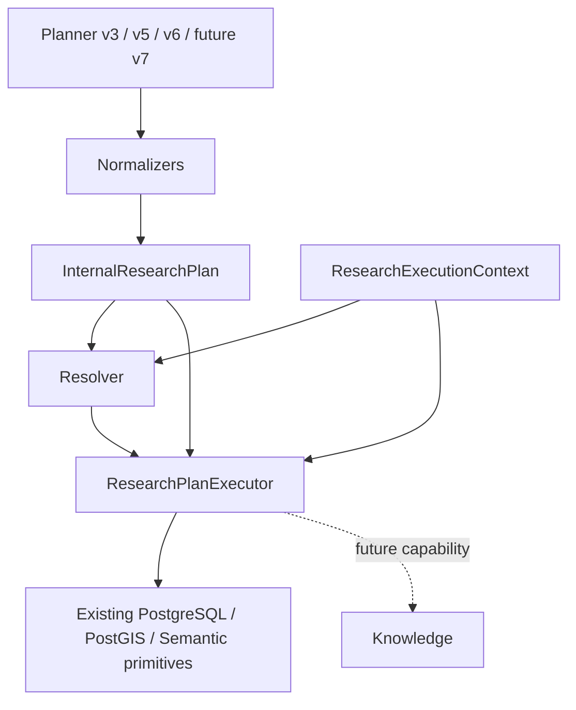
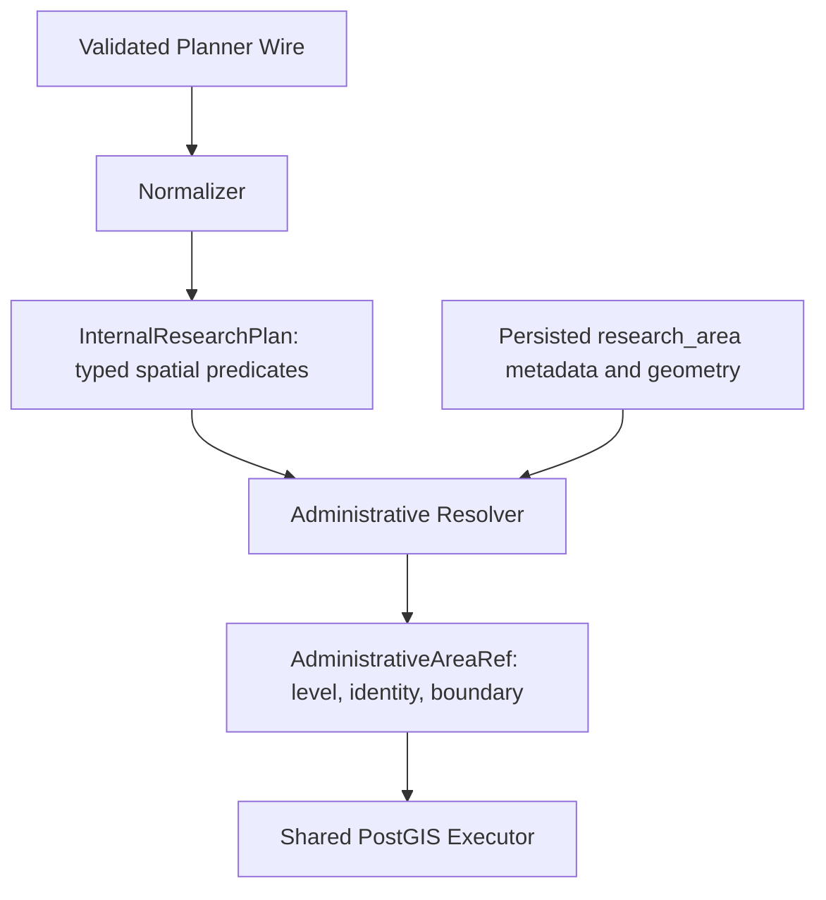

# Planner Wire Contract != Admin Execution Model

## Audit before implementation

Baseline: `d1e7476fe7966366a220dcc8734842bfe028127d`, freshly fetched `main`.
This describes repository code, not verification of a running deployment.

`/api/v1/research/query` currently passes a `PlanResponse` (v3),
`AnalyticalPlanResponse` (v5), or `GeographicPlanResponse` (v6) straight to
`ResearchPlanExecutor.execute`. The executor reads transport disposition,
original query, reference date, timezone and diagnostics from that envelope.
It uses `isinstance(AnalyticalQueryPlan)` for time-of-day semantics, taxonomy
and spatial ranking, and `isinstance(GeographicQueryPlan)` for location context.
`resolve_plan` accepts wire plans and branches on `GeographicQueryPlan`.

Existing execution primitives are already shared: `count_selection`,
`aggregate_selection`, `chronological_records`, `eligible_event_ids`,
`spatial_records`, `taxonomy_selection`, plus classic `research_page` and
bounded semantic retrieval with authoritative rehydration. They share the
public source population, occurrence/effective venue handling and bound SQL.
There is no need for another SQL implementation or version-specific executor.

Resolution already shares authoritative area, venue, organization, category,
event type and composite genre lookup. Taxonomy uses exact matches, typography
normalization and conservative inflection; genre/type conflicts fail closed.
Named places use the internal geocoder. Nearby queries use transient browser
or manual location context. These operations remain unchanged.

Version-dependent details belong at normalization: v3 evening means >=18:00;
v5/v6 evening means [18:00,22:00). v3 lacks analytical/geographic slots; v5 lacks
place/nearby slots. The existing analytical mismatch veto rejects plans rather
than repairing them; it moves to the adapter boundary without new heuristics.
The strict transport client and its frozen wire contracts remain unchanged.

The separate v4 domain/knowledge route is outside this v3/v5/v6 pipeline refactor;
its existing behavior and metric implementation remain untouched.

## Target dependency direction



A future v7 transport flag selects a client contract and its normalizer, never
an executor. There must be no `V7ResearchExecutor`: that would duplicate population,
visibility, temporal and capability rules. Internal constraints should grow only
when Admin actually implements their semantics.

## Implementation

`app/research/plan.py` defines frozen, typed dataclasses owned by Admin. They are
not request/response schemas and do not appear in OpenAPI. The plan contains:

- `intent`, `entity_type`, `metric`, `group_by`, `ordering`, `limit`, `taxonomy`;
- `filters`: venue/organization names and event type/category/genre query tuples;
- `temporal`: relative period, explicit dates, lower time bound and time-of-day;
- `spatial_constraints`: immutable AND predicates with typed area/place/user/border references;
- `spatial_metric`: the existing longitude/latitude ranking selector;
- `semantic`: query and optional focus, whose presence requires semantic execution;
- comparison targets, clarification and explicit unsupported reason.

The `price`, `relation`, `trend`, `anomaly`, `explain` and `knowledge` extension
slots currently accept only `None`. This is intentional: this change invents no
constraint semantics or provisional v7 model. A future implementation must add
Admin-owned typed constraints, a capability check and tests before an adapter can
emit one. Unexpected nonempty extension slots and currently unimplemented intents
fail with `research_execution_unsupported` before resolution or source access.

`ResearchExecutionContext` carries `reference_date`, `timezone`, transient
`location_context`, and `original_query` for HTTP response identity. None is part
of plan equality. It is neither logged nor persisted. Planner latency is an
explicit execution argument, not a semantic field.

Old signature:

```python
execute(request, settings,
        plan_response: PlanResponse | AnalyticalPlanResponse | GeographicPlanResponse,
        *, planner_ms: float | None = None, location_context: LocationContext | None = None)
```

New signature:

```python
execute(request, settings,
        plan: InternalResearchPlan, context: ResearchExecutionContext,
        *, planner_ms: float) -> ResearchExecutionOutcome
```

`normalize_v3`, `normalize_v5` and `normalize_v6` in `app/research/normalize.py`
share only the genuinely common mapping. `normalize` is the closed transport
version dispatch. `normalize_v7` belongs at the explicit comment in that module
once its coordinated wire contract is integrated. This PR neither imports a v7
contract nor enables a new endpoint or flag.

`resolve_plan(request, settings, plan, context)` receives the same internal model.
It does not inspect schema versions. Existing exact/normalized taxonomy lookup,
composite genre IDs, ambiguity, parent conflicts, area lookup and geocoder
behavior remain unchanged.

`app/research/capabilities.py` holds the common pre-execution capability gate.
`ResearchPlanExecutor` dispatches by internal intent and reuses all six existing
repository primitives without changing source SQL. Unsupported operations cannot reach a
generic records fallback. Semantic counts remain unsupported, and structured
eligibility still precedes ranking and authoritative rehydration.

The outcome carries the existing result models, resolution, provenance, observed
time and diagnostics. The API combines it with the validated wire envelope in
`schemas/research_response.py`. This keeps Planner provenance visible without
making it an executor input. The HTTP contract, result discriminators, learned
suggestion eligibility, auth/CSRF boundaries and location privacy are unchanged.
No new result family, frontend change, runtime setting or migration is required.

## Regression coverage and limits

`tests/test_research_internal_plan.py` checks explicit mappings, equivalent v5/v6
plans across the existing analytical corpus, context separation, immutable
normalization, primitive/result/provenance parity, unsupported operations and the
HTTP boundary. Its AST/type-hint guard rejects Planner schema imports and version
inspection in executor/resolver/domain modules. It also checks that internal types
do not appear in OpenAPI. The existing exact OpenAPI snapshot remains unchanged.

Existing execution, taxonomy, chronology, geography, semantic-eligibility and
client security regressions continue through the normalizer. Database tests retain
their disposable PostgreSQL/PostGIS fixtures; this refactor adds no alternative SQL
path or fake database backend. Docker tests are not run locally; CI is not awaited.

Currently executable operations stay records/search/recommendation, exact count,
aggregate (including occurrence ranking by event), compare, taxonomy and spatial
coordinate ranking. General `rank`, relation, trend, anomaly, explain and knowledge
are not enabled in this pipeline. The separate v4 knowledge route remains available
under its existing configuration. These are existing capability boundaries, not a
claim that the Planner's full future vocabulary is executable.

## Change inventory

Branch: `refactor/research-internal-plan`.

| Files                                                 | Change                                                              |
| ----------------------------------------------------- | ------------------------------------------------------------------- |
| `backend/app/research/plan.py`                        | Internal intent and immutable domain selections                     |
| `backend/app/research/context.py`                     | Separate request/runtime context                                    |
| `backend/app/research/normalize.py`                   | Thin v3/v5/v6 adapters and future v7 insertion point                |
| `backend/app/research/capabilities.py`                | Shared capability rejection before source access                    |
| `backend/app/research/outcome.py`                     | Version-independent outcome using existing result classes           |
| `backend/app/services/research_plan_execution.py`     | Internal-only signature, intent dispatch, unchanged primitive calls |
| `backend/app/repositories/research_resolution.py`     | Internal-only input and shared context; no SQL changes              |
| `backend/app/api/research.py`                         | Normalize before execution; assemble the wire response afterward    |
| `backend/app/schemas/research_execution.py`           | Existing result models, with the transport wrapper extracted        |
| `backend/app/schemas/research_response.py`            | The unchanged public response envelope                              |
| `backend/app/schemas/research_values.py`              | Execution response primitives independent of Planner schemas        |
| `backend/app/services/research_learning.py`           | Import the moved public response type; behavior unchanged           |
| `backend/tests/research_plan_helpers.py`              | Normalize wire fixtures before execution                            |
| `backend/tests/test_research_internal_plan.py`        | Mapping, context, parity, failure and architecture guards           |
| `backend/tests/test_research_plan_execution.py`       | Existing execution regressions use internal inputs                  |
| `backend/tests/test_research_analytics.py`            | Existing analytical regressions use internal inputs                 |
| `backend/tests/test_research_geography.py`            | Existing geographic regressions pass separate context               |
| `backend/tests/test_research_taxonomy.py`             | Existing resolver/genre-conflict regressions use internal inputs    |
| `backend/tests/test_research_chronology.py`           | Existing time/order regressions use internal inputs                 |
| `backend/tests/test_research_semantic_eligibility.py` | Existing eligibility/snapshot regressions use internal inputs       |
| `docs/research/internal-plan-architecture.md`         | Audit, architecture, capability limits and validation report        |

Duplication assessment: no source execution SQL was added or copied. Area resolution
adds the existing `municipality_key` column to its internal metadata projection. The shared population and
six repository primitives are unchanged. No v7 executor, resolver, result types,
or parallel execution branch exists. The only version dispatch is normalization
at the transport boundary; existing planner selection and transport remain intact.

## Administrative geography audit (scope extension)

`admin.research_area` already stores an immutable UUID/OSM relation identity,
`area_type` (`region`, `district`, `municipality`), `country_code`, `region_code`,
`osm_admin_level`, validated MultiPolygon/centroid and optional `municipality_key`.
`ResearchArea` exposes metadata; `ResolvedResearchArea` adds EWKB for bound PostGIS
queries. Its current public projection does not expose municipality keys or a
parent graph. BKG population imports bind their evidence to the German eight-digit
municipality key. The catalog owns the existing German state-key/ISO-region mapping.
There is no persisted district key, generic official-code column or parent FK.

German municipality imports validate AGS, country, region and OSM level, including
explicit verified independent-city/city-state exceptions. Consequently Flensburg
must remain a municipality even though its OSM admin level is 6. Existing `region`
rows at German admin level 4 can be classified as states from metadata, without a
name heuristic. District rows/admin level 6 must not collapse into generic regions.
No currently deployed state/district/country inventory is inferred from fixtures.

Research already uses `ST_Covers(boundary, effective_venue.point)` for inside and
its negation for outside, with explicit nonempty/valid coordinate guards. Boundary
points count inside, never outside; unknown geometry is excluded from both. Event
location is the occurrence's effective venue (date override, then event venue),
not a geocoder point, organization point or newly invented event geometry. The
existing space-inheritance override rules remain unchanged.

The classic multi-area primitive unions polygons (OR); it must not be reused to
silently implement administrative AND predicates. v5/v6 expose only one area query
and one inside/outside relation, and no district/state grouping vocabulary. The
internal model preserves spatial predicates and distinct
administrative levels, while rejecting unsupported combinations explicitly.
The geographic service returns places/addresses/bboxes, not a verified hierarchy
or AGS; administrative membership continues to resolve persisted boundaries without
calling Nominatim or importing boundaries during an interactive request.

## Administrative execution model

Planner "region" != Admin resolved administrative level. `geography.py` owns
`AdministrativeLevel` (`country`, `state`, `district`, `municipality`, `region`),
`AdministrativeAreaRef`, `AdministrativeIdentity`, `BoundaryReference`,
`AdministrativeHierarchy` and typed spatial references. They are internal frozen
dataclasses, not additions to browser input or OpenAPI.



An unresolved `AdministrativeAreaRef` contains the lookup name and `level=None`.
Resolution replaces it with persisted identity, explicit level and a boundary
reference to the same `admin.research_area` UUID whose EWKB is used in the query.
The executor verifies matching resolved/boundary IDs and the preserved spatial
relation before building filters; an unresolved area cannot become an unfiltered
query. No `area_query` string is passed to source execution. Name-based resolution
keeps its existing ambiguity/no-match behavior. No runtime boundary import occurs.

Metadata classification (names below illustrate the data, not a name lookup table):

| Stored metadata                                     | Example                           | Internal level |
| --------------------------------------------------- | --------------------------------- | -------------- |
| DE, region, OSM level 4                             | Schleswig-Holstein                | state          |
| DE, district (or region at OSM level 6)             | Schleswig-Flensburg               | district       |
| municipality, including verified level-6 exceptions | Flensburg                         | municipality   |
| municipality, including verified level-4 exceptions | Hamburg                           | municipality   |
| region, OSM level 2                                 | country boundary, if provisioned  | country        |
| other region                                        | unspecified/non-equivalent region | region         |

German municipality identity takes precedence over OSM level. `ResolvedResearchArea`
now additionally reads the already stored `municipality_key`; its public
`ResearchArea` projection is unchanged. Official codes carry separate systems:
`DE-AGS` preserves all eight digits, `DE-state` uses the existing catalog's
state-key/ISO-region mapping (e.g. `01`), and country codes use `ISO-3166-1`.
`DE-district`/`ISO-3166-2` identities are representable but no missing district code
is manufactured. Source UUID and OSM identity remain available even without an
official code. No schema migration or new geography source is required.

The hierarchy represents country → state → district → municipality through
explicit direct-parent identities and separately known ancestors. Persisted
country/region metadata establishes state → country and district → state.
Municipalities have known state/country ancestors, but their direct district is
unknown in current storage. `AdministrativeHierarchy.children` and `descendants`
keep this distinction. A state is never relabeled as a municipality's direct
parent just because its district is missing. The hierarchy contains the areas
resolved for this request, not a newly imported national catalog. Parent identities
do not imply that parent boundaries are cached or executable.

## Spatial membership and examples

All `spatial_constraints` are AND predicates. v5/v6 adapters emit the one area
constraint their wire supports and preserve an additional named-place/nearby
constraint when present. Administrative inside/outside accepts one cached boundary
and uses existing source primitives. The capability gate rejects more than one
administrative boundary, more than one place/user reference, border/cardinal/radius
extensions and unsupported administrative grouping **before** resolution/SQL.
No condition is thrown away and the OR-union primitive is not used for AND.

- Outside Schleswig-Holstein: a resolved `state` reference plus `outside` reaches
  the existing area predicate, provided that authoritative cached boundary exists.
- Inside Kreis Schleswig-Flensburg: a uniquely resolved district boundary remains
  `district`; source execution uses its UUID/EWKB. No textual city/state substitution.
- Inside Flensburg: the imported municipality identity survives its level-6 OSM role.
- Outside Schleswig-Holstein AND inside Germany: both constraints are representable
  internally, but execution explicitly reports `research_execution_unsupported`.
  The current wire cannot express both and the current SQL primitive accepts one.

Membership stays `ST_Covers(boundary, effective_venue.point)` (equivalent direction
to `ST_CoveredBy(point,boundary)`), not `ST_Within`. Boundary points are inside.
Outside is its negation **only for known, valid, nonempty points with valid
coordinates**. Unknown/empty/invalid points are excluded from both populations.
The effective event venue is `COALESCE(event_date.venue_uuid,event.venue_uuid)`;
a space or organization point does not replace it. Source eligibility, occurrence
selection, timezone and venue override handling are unchanged.

## Explicit remaining geography capabilities

| Capability                                           | Status / missing evidence                                                                                          |
| ---------------------------------------------------- | ------------------------------------------------------------------------------------------------------------------ |
| One inside/outside administrative boundary           | Executable with a unique cached area; resolved level and ID retained                                               |
| Multiple administrative AND predicates               | Internal representation ready; v5/v6 wire and execution not yet supported                                          |
| Group by municipality/district/state/country         | Distinct internal values; explicit unsupported until wire selection and non-overlapping population/group SQL exist |
| Municipalities with zero events in a district        | Needs authoritative complete child inventory plus zero-preserving aggregation; not enabled                         |
| District official IDs / municipality parent district | Not stored; remain unknown; no substring-derived or guessed IDs                                                    |
| State/country/district inventory                     | Not established by synthetic fixtures; current operator import primarily provisions municipalities                 |
| Independent cities / city states                     | Primary municipality identity preserved; overlapping district/state roles are not automatically expanded           |
| Border hierarchy / near/across border                | Typed separately from outside; no verified border resolver/execution or invented radius                            |
| Danish equivalent levels                             | Imported municipalities remain municipality; other regions stay region until an authoritative equivalence is added |
| General v7 execution                                 | No contract import, transport or parallel executor; future adapter belongs in `normalize.py`                       |

No new aggregate result format is needed: these new administrative groupings do
not yet produce results. A later implementation must expose level/official identity
through the common result contract with coordinated frontend changes.

## Additional files and validation scope

| Files                                                 | Change                                                                                            |
| ----------------------------------------------------- | ------------------------------------------------------------------------------------------------- |
| `backend/app/research/geography.py`                   | Generic administrative hierarchy and spatial references                                           |
| `backend/app/repositories/research_administrative.py` | Metadata-only administrative classification and official identities                               |
| `backend/app/repositories/research_areas.py`          | Include existing municipality key in internal resolution                                          |
| `backend/tests/test_research_administrative.py`       | Classification, hierarchy, ambiguity, identity-only filters, explicit gaps and PostGIS regression |

Tests cover v5/v6 equivalence, classifications, parent versus ancestor semantics,
unknown/ambiguous areas, grouping-level preservation, multi-predicate rejection,
resolved-boundary checks and existing count/aggregate/taxonomy/spatial outputs.
Real PostgreSQL/PostGIS fixtures check boundary inclusion and exclusion of unknown
geometry; they require CI's disposable database. The AST guard includes the new
geography and administrative resolver modules. Transport hardening remains covered
by the existing Planner client suite; no transport code was changed.

`tests/test_semantic_search.py` also supplies the newly read optional municipality
key in its mocked area row; semantic/classic response expectations stay unchanged.

Only backend and documentation changed. Frontend, Ansible, dependencies, runtime
flags, source SQL, grants and migrations are unchanged. OpenAPI is checked against
the existing generated snapshot rather than hand edited. No Docker tests or CI
waiting are part of local validation.

## Local validation and review status

Commands use the repository's documented `backend/` working directory and existing
locked environment (`uv run --no-sync --offline`). No dependencies were changed.

- `ruff check .`: passed.
- `ruff format --check .`: passed (347 files).
- `mypy`: passed (233 source files).
- Internal-plan/admin-geography/OpenAPI regressions: **98 passed, 2 skipped**.
- Full `pytest -q`: **3182 passed, 1066 skipped, 3 failed** on the first completed
  run. All three failures were the same pre-existing mocked area row missing the
  newly projected `municipality_key`; the fixture now supplies `None`. The entire
  affected semantic-search module was rerun after that correction:
  **125 passed, 20 skipped**, including all three previously failing cases.
- `git diff --check`: passed; documentation Prettier check passed.

Database/PostGIS and other service-dependent tests skip without their configured
local services; no Docker services were started. The full suite was not silently
reported green after correcting its fixture. The additional three boundary-guard
cases were run in the later focused suite. Earlier exploratory attempts from the
repository root are not the configured backend gates (pytest fixtures require
`backend/`; root-wide Ruff also includes unrelated deployment/Ansible files).

Frontend/Ansible gates are left to their established CI applicability: neither
subsystem nor its contract/configuration changed. GitHub CI is not awaited.
Merge readiness: ready for review after local checks; final merge approval still
requires CI's real PostgreSQL/PostGIS checks. No merge is performed by this change.
